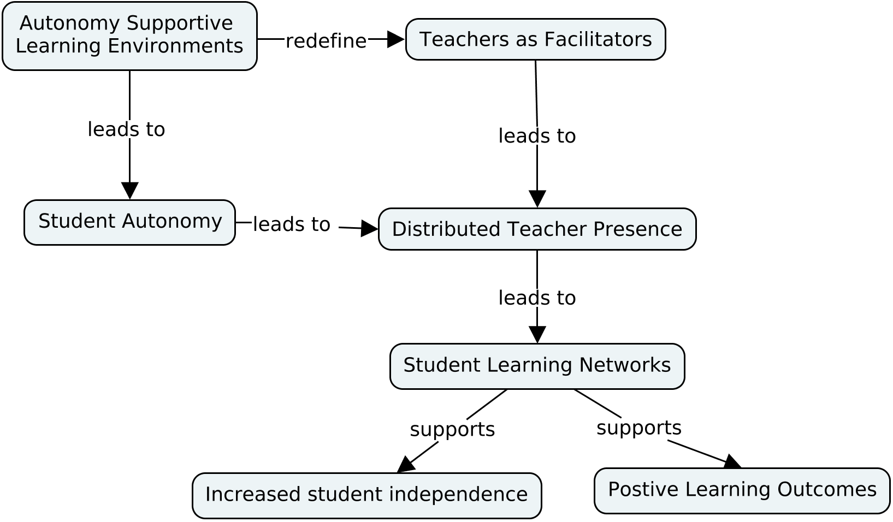
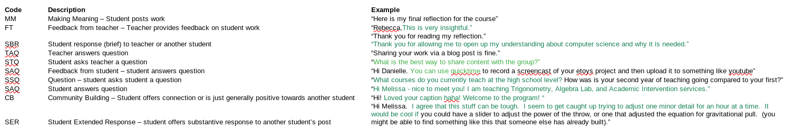
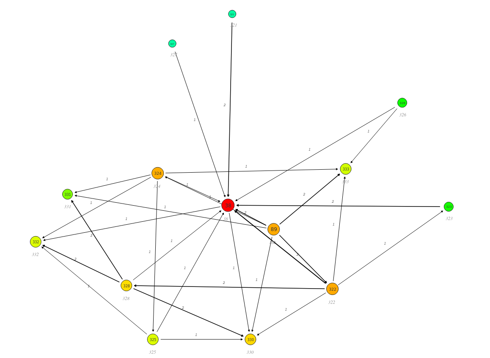
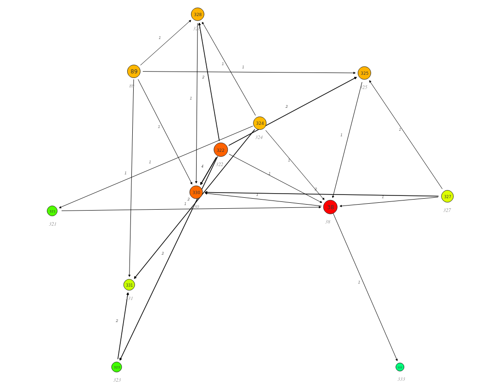
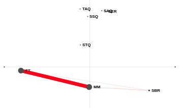
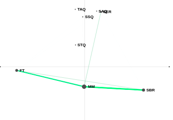
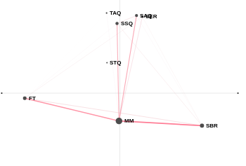

## Conceptual Framework

```{r, out.width = "1000px", echo = FALSE, fig.align = "center"}

```

## Research Questions
   
1. What are the patterns of interactions that occur when teachers and teacher candidates are learning CT and CS skills and concepts?
2. How are these patterns of interactions shaped by a collaborative learning environment?

## The Context

- 14 teachers/teacher candidates in a course entitled "CS for Teachers"
- Conducted in a social learning platform built with Elgg software
- Spring 2016 semester


## The Methods
- Students participate in the course via a series of units focused on the history of CS in K-12 schools, core research, and coding via robotics.
- While they worked in this asynchronous course, they were able to interact with the teacher and one another.
- Those interactions were extracted and analyzed.

## Data Analysis, part 1
- Social Network Analysis (SNA) - to visualize student networks for each learning activity
- Every interactions was coded (codebook to follow)
- Epistemic Network Analysis (ENA) was used to visualize the epistemic space of each learning activity.

## Data Analysis, part 2/Codebook

```{r, out.width = "1000px", echo = FALSE, fig.align = "center"}

```

## Findings - SNA, part 1/Reflection
```{r, out.width = "1000px", echo = FALSE, fig.align = "center"}
knitr::include_graphics("img/pc_spring2016_a_reflection_info_fr_png.png")
```


## Findings - SNA, part 2/Read-Respond

```{r, out.width = "800px", echo = FALSE, fig.align = "center"}

```

## Findings - SNA, part 3/Robotics
```{r, out.width = "800px", echo = FALSE, fig.align = "center"}

```


## Findings - ENA, part 1/Reflection
```{r, out.width = "800px", echo = FALSE, fig.align = "center"}

```

## Findings - ENA, part 2/Read-Respond
```{r, out.width = "800px", echo = FALSE, fig.align = "center"}

```


## Findings - ENA, part 3/Robotics
```{r, out.width = "800px", echo = FALSE, fig.align = "center"}

```


## Discussion - What Did We Learn?
- Patterns of interactions in open vs closed learning activites

- Evidence of student autonomy and engagement

- Future work


## Questions?

## Thanks
- gerald.ardito@mville.edu

- @geraldardito


