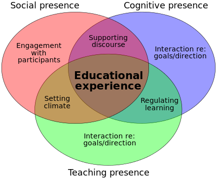
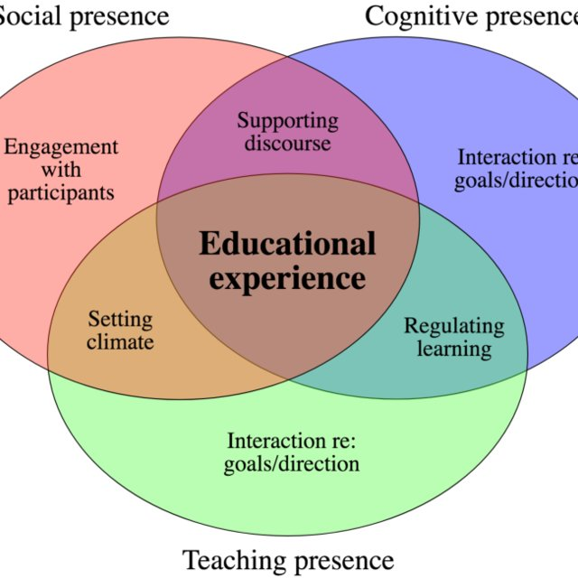
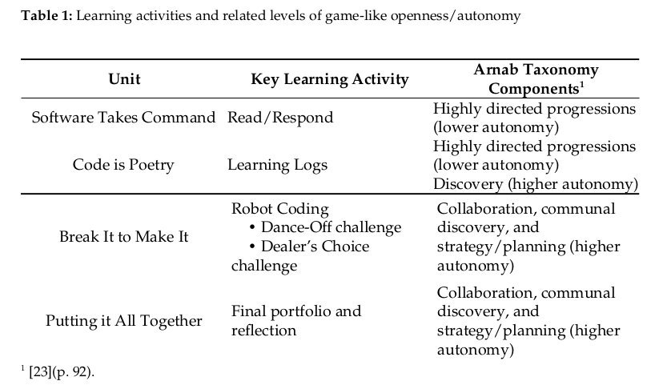
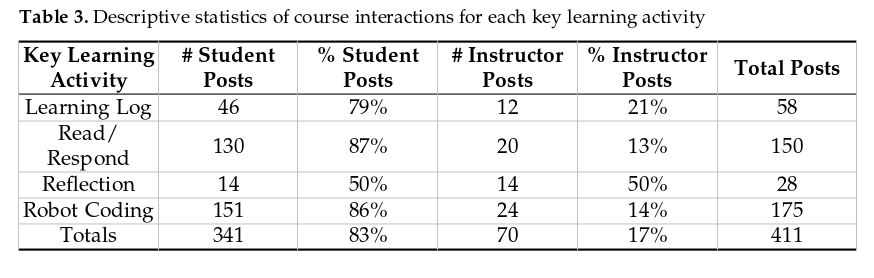

## What Are We Up To?
1. What lessons can we take away from pandemic teaching/teaching during the pandemic?
2. What can this unique time teach us about instructional design?
3. What are the connections between instructional design, student engagement, and learning outcomes?

## Part 1: Community of Inquiry
- The **Community of Inquiry (CoI)** framework was developed by Garrison, D. R., Anderson, T., & Archer, W. (2000).
- The CoI framework attempted to **apply the work of Dewey and Lipman** into online learning environments, which at that time were mostly text/discussion based.
- The goal was to understand how **inquiry-based learning** could take place in **online learning environments**.
- The CoI model also applies to face to **face/synchronous learning environments**

## The Community of Inquiry Model
```{r, out.width = "600px", echo = FALSE, fig.align = "center"} 

```
Garrison, D. R., Anderson, T., & Archer, W. (2000)

## Teaching Presence
**Teaching Presence** is the design, facilitation, and direction of cognitive and social processes for the purpose of realizing personally meaningful and educationally worthwhile learning outcomes 
(Anderson, Rourke, Garrison, & Archer, 2001).

## Cognitive Presence
**Cognitive Presence** is the extent to which learners are able to construct and confirm meaning through sustained reflection and discourse.
(Garrison, Anderson, & Archer, 2001).

## Social Presence
**Social presence** is “the ability of participants to identify with the community (e.g., course of study), communicate purposefully in a trusting environment, and develop inter-personal relationships by way of projecting their individual personalities.” 
(Garrison, 2009, p. 352).

## The Magic is in the Connections/Intersections
```{r, out.width = "500px", echo = FALSE, fig.align = "center"}

```

## Questions, Comments, Wonderings about CoI
```{r, out.width = "800px", echo = FALSE, fig.align = "center"}

```

## Part 2: A Case Study

## Conceptual Framework

```{r, out.width = "1000px", echo = FALSE, fig.align = "center"}
knitr::include_graphics("img/edmedia-2021-concept-model.png.png")
```

## Research Questions
   
1. What patterns of connections and interaction emerge between students and their instructor in an open world game type of instructional design?
2. How are these connections and patterns of interactions the same and/or different than patterns of connections and interactions between students and their instructor in a more traditional type of instructional design?

## The Context

- 14 teachers/teacher candidates in a course entitled "CS for Teachers"
- Conducted in a social learning platform built with Elgg software
- Spring 2016 semester
- Instructional design shaped by Arnab, et al. taxonomy

## Taxonomy of Game Design Elements/Autonomy

```{r, out.width = "1000px", echo = FALSE, fig.align = "center"}

```

## The Methods
- Students participate in the course via a series of units focused on the history of CS in K-12 schools, core research, and coding via robotics.
- While they worked in this asynchronous course, they were able to interact with the teacher and one another.
- Those interactions were extracted and analyzed.

## Data Analysis, part 1
- Social Network Analysis (SNA) - to visualize student networks for each learning activity
- Every interactions was coded (codebook to follow)
- Epistemic Network Analysis (ENA) was used to visualize the epistemic space of each learning activity.

## Data Analysis, part 2/Codebook

```{r, out.width = "1500px", echo = FALSE, fig.align = "center"}
knitr::include_graphics("img/Fig1.png")
```

## Findings - SNA, part 1/Reflection
```{r, out.width = "1000px", echo = FALSE, fig.align = "center"}
knitr::include_graphics("img/Fig2.png")
```


## Findings - SNA, part 2/Learning Logs

```{r, out.width = "800px", echo = FALSE, fig.align = "center"}
knitr::include_graphics("img/Fig3.png")
```


## Findings - SNA, part 3/Read-Respond

```{r, out.width = "800px", echo = FALSE, fig.align = "center"}
knitr::include_graphics("img/Fig4.png")
```


## Findings - SNA, part 4/Robotics
```{r, out.width = "800px", echo = FALSE, fig.align = "center"}
knitr::include_graphics("img/Fig5.png")
```

## Findings - Coding Descriptive Stats
```{r, out.width = "800px", echo = FALSE, fig.align = "center"}

```

## Findings - ENA, part 1/Reflection
```{r, out.width = "800px", echo = FALSE, fig.align = "center"}
knitr::include_graphics("img/Fig6.png")
```

## Findings - ENA, part 2/Learning Logs
```{r, out.width = "800px", echo = FALSE, fig.align = "center"}
knitr::include_graphics("img/Fig7.png")
```

## Findings - ENA, part 3/Read-Respond
```{r, out.width = "700px", echo = FALSE, fig.align = "center"}
knitr::include_graphics("img/Fig8.png")
```

## Findings - ENA, part 4/Robotics-Coding
```{r, out.width = "800px", echo = FALSE, fig.align = "center"}
knitr::include_graphics("img/Fig9.png")
```


## Discussion - What Did We Learn?
- Learner connections and interaction patterns vs Arnab/autonomy taxonomy
- Evidence of student autonomy and engagement
- There's lots of room to play with instructional design in the CoI model


## Questions?
```{r, out.width = "800px", echo = FALSE, fig.align = "center"}

```

## Part 3: Let's Talk about Your Courses/Instructional Design
```{r, out.width = "800px", echo = FALSE, fig.align = "center"}
knitr::include_graphics("img/lets_talk.jpg")
```

## Thanks
- gerald.ardito@mville.edu
 


