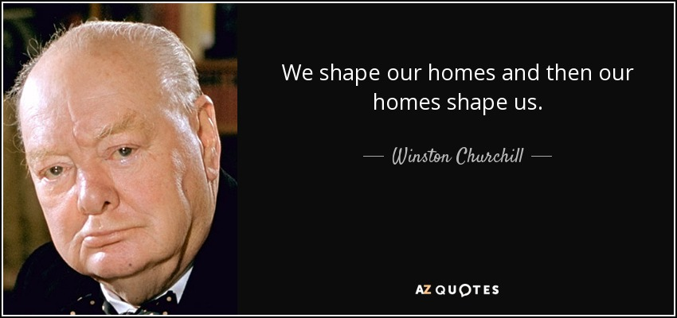
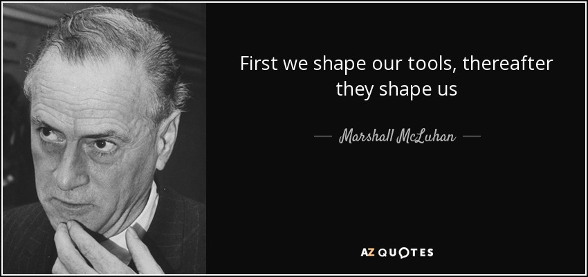
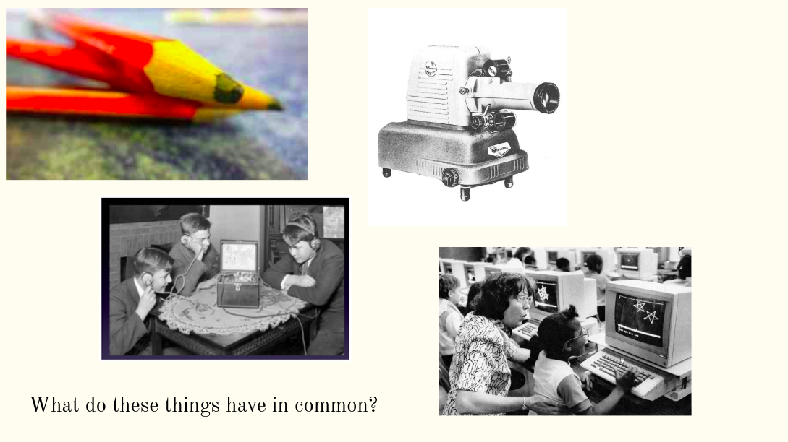
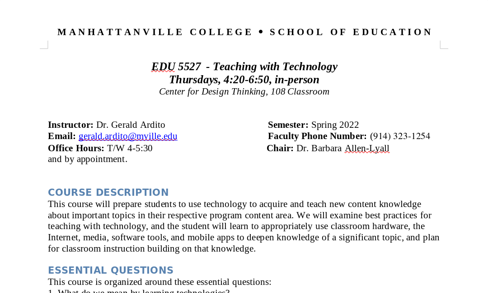

## What Are We Up To?

```{r, out.width = "1000px", echo = FALSE, fig.align = "center"}

```

## What Are We Up To?

```{r, out.width = "1000px", echo = FALSE, fig.align = "center"}

```

## Essential Questions
   
1. What do we mean by technology?
2. What do we mean by educational technologies?
3. What do we know about using technology to enhance/promote/support learning?

## A Question for you

```{r, out.width = "1000px", echo = FALSE, fig.align = "center"}

```

## Our Tools, Moodle

```{r, out.width = "1000px", echo = FALSE, fig.align = "center"}

```

## Our Tools, Mattermost

```{r, out.width = "1000px", echo = FALSE, fig.align = "center"}

```

## How Should We Work Together?
```{r, out.width = "1000px", echo = FALSE, fig.align = "center"}

```


## How Should We Work Together?
```{r, out.width = "450px", echo = FALSE, fig.align = "center"}

```

## What Should We Do?
```{r, out.width = "1000px", echo = FALSE, fig.align = "center"}

```

## What Should We Do?
```{r, out.width = "1000px", echo = FALSE, fig.align = "center"}

```

## Questions?
```{r, out.width = "1000px", echo = FALSE, fig.align = "center"}

```

## Getting To Work
```{r, out.width = "600px", echo = FALSE, fig.align = "center"}

```


