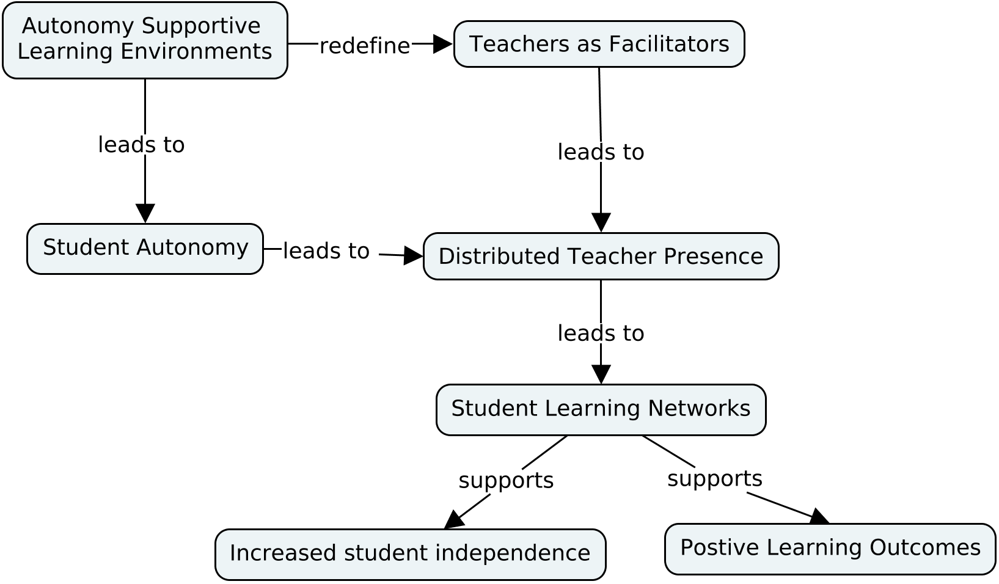
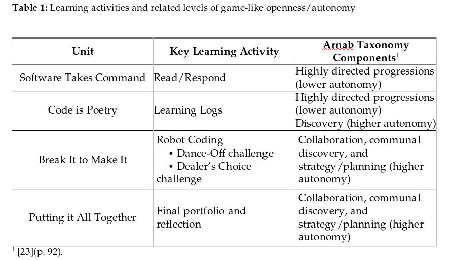
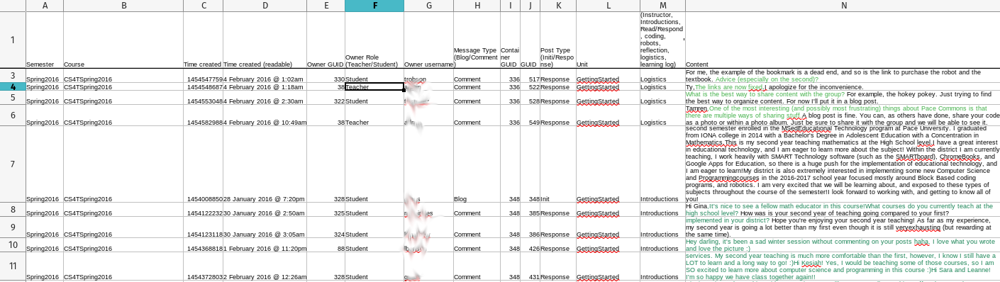
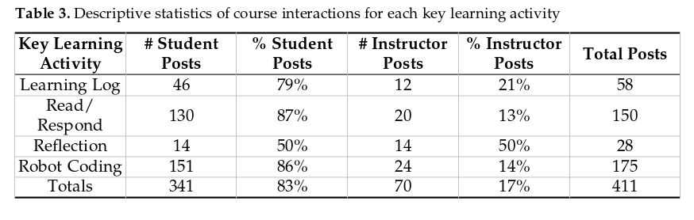

## Conceptual Framework

```{r, out.width = "1000px", echo = FALSE, fig.align = "center"}

```

## Research Questions
   
1. What patterns of connections and interaction emerge between students and their instructor in an open world game type of instructional design?
2. How are these connections and patterns of interactions the same and/or different than patterns of connections and interactions between students and their instructor in a more traditional type of instructional design?

## The Context

- 14 teachers/teacher candidates in a course entitled "CS for Teachers"
- Conducted in a social learning platform built with Elgg software
- Spring 2016 semester
- Instructional design shaped by Arnab, et al. taxonomy

## Taxonomy of Game Design Elements/Autonomy

```{r, out.width = "1000px", echo = FALSE, fig.align = "center"}

```

## The Methods
- Students participate in the course via a series of units focused on the history of CS in K-12 schools, core research, and coding via robotics.
- While they worked in this asynchronous course, they were able to interact with the teacher and one another.
- Those interactions were extracted and analyzed.

## Data Analysis, part 1
- Social Network Analysis (SNA) - to visualize student networks for each learning activity
- Every interactions was coded (codebook to follow)
- Epistemic Network Analysis (ENA) was used to visualize the epistemic space of each learning activity.

## Data Analysis, part 2/Codebook

```{r, out.width = "1500px", echo = FALSE, fig.align = "center"}

```

## Findings - SNA, part 1/Reflection
```{r, out.width = "1000px", echo = FALSE, fig.align = "center"}
knitr::include_graphics("img/Fig2.png")
```


## Findings - SNA, part 2/Learning Logs

```{r, out.width = "800px", echo = FALSE, fig.align = "center"}
knitr::include_graphics("img/Fig3.png")
```


## Findings - SNA, part 3/Read-Respond

```{r, out.width = "800px", echo = FALSE, fig.align = "center"}
knitr::include_graphics("img/Fig4.png")
```


## Findings - SNA, part 4/Robotics
```{r, out.width = "800px", echo = FALSE, fig.align = "center"}
knitr::include_graphics("img/Fig5.png")
```

## Findings - Coding Descriptive Stats
```{r, out.width = "800px", echo = FALSE, fig.align = "center"}

```

## Findings - ENA, part 1/Reflection
```{r, out.width = "800px", echo = FALSE, fig.align = "center"}
knitr::include_graphics("img/Fig6.png")
```

## Findings - ENA, part 2/Learning Logs
```{r, out.width = "800px", echo = FALSE, fig.align = "center"}
knitr::include_graphics("img/Fig7.png")
```

## Findings - ENA, part 3/Read-Respond
```{r, out.width = "800px", echo = FALSE, fig.align = "center"}
knitr::include_graphics("img/Fig8.png")
```

## Findings - ENA, part 4/Robotics-Coding
```{r, out.width = "800px", echo = FALSE, fig.align = "center"}
knitr::include_graphics("img/Fig9.png")
```


## Discussion - What Did We Learn?
- Learner connections and interaction patterns vs Arnab/autonomy taxonomy

- Evidence of student autonomy and engagement

- Future work


## Questions?

## Thanks
- gerald.ardito@mville.edu
- bcozkan@email.arizona.edu 


