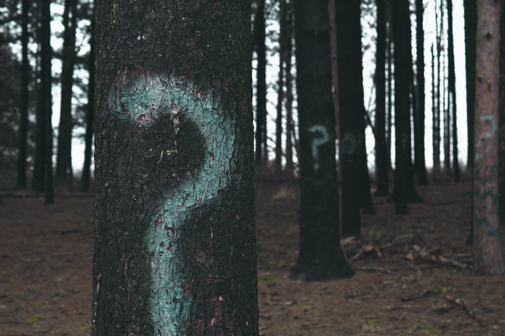

## Welcome/Intros
   
1. Your teaching - who, where, what?
2. Your experience with and/or teaching with Computer Science/Computational Thinking?

## Some Guiding Questions
   
1. What does it mean to integrate Computer Science and Digital Literacy Learning Standards into our work with students?
2. How can we identify areas of intersection?
3. What are the high level opportunities (instead of the low hanging fruit)?

## Round 1 Priorities

```{r, out.width = "1500px", echo = FALSE, fig.align = "center"}

```


## What Do We Already Do?
- Read critically to find meaning (setting, character, tone, etc.)
- Learn Math
- Learn Science
- Perform Music
- Make Art

All of these are foundations on which we can build

## Let's Start with Cybersecurity
Major Ideas
- Identity
- Trust
- Privacy

## Where Do Our Students Already Encounter these Ideas

- ELA - themes in books and other readings
- Music/Art/ELA - how do we recognize authors and their unique contributions
- Science - DNA/Genetic Code, Elements and Molecules in Chemistry
- History - What makes cultures unique? What happens when cultures clash?


## ELA Examples
A cool tool is [Plotting Plots](https://plottingplots.com).

```{r, out.width = "1500px", echo = FALSE, fig.align = "center"}

```

## Examples - Where the Students Already Are
Recommendation Engines: TikTok, YouTube, Instagram, etc. 

```{r, out.width = "1500px", echo = FALSE, fig.align = "center"}
knitr::include_graphics("img/YouTubeSpiderMan.png")
```
## What About Digital Literacy
Focus area:
- Digital Use
- Digital Citizenship


## DL - What Do We Already Do?
Digital Use
- Communication Tools: Slides, Images, Music/Audio, Web Pages(?)
- Multiple Means of Representation and Expression (UDL)
- Evaluating Reliable Sources

## DL - What Do We Already Do?
Digital Citizenship

- What would somebody know about us from our online use?
[Connects with Cybersecurity]

## DL Examples

- Collaboration Tools
```{r, out.width = "1500px", echo = FALSE, fig.align = "center"}
knitr::include_graphics("img/GD_explore_tools.png")
```


## A Way Out (Maybe Not) Idea
```{r, out.width = "1500px", echo = FALSE, fig.align = "center"}

```


## Questions?/Comments?
```{r, out.width = "1500px", echo = FALSE, fig.align = "center"}

```

## Thanks
- gerald.ardito@mville.edu

- @geraldardito


