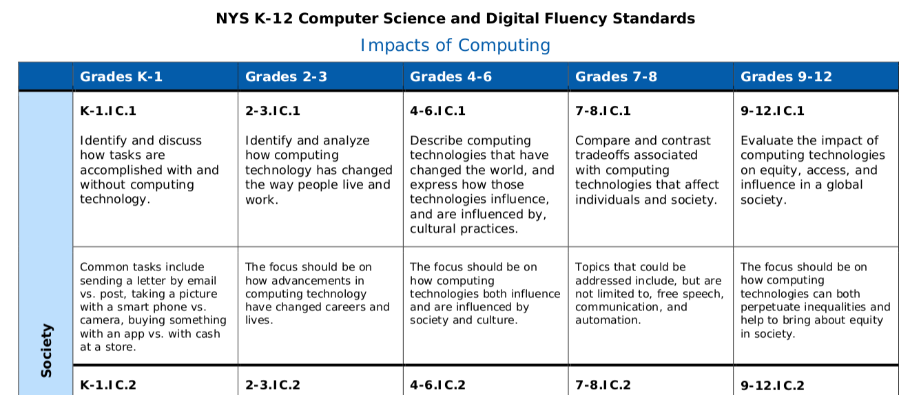

## Research Question
   
1. What can a close reading of a Computer Science Learning Standards document tell us about the coherence and incoherence of these standards?

## Conceptual Framework
```{r, out.width = "1500px", echo = FALSE, fig.align = "center"}

```


## The New York State Computer Science/Digital FLuency Learning Standards

```{r, out.width = "1500px", echo = FALSE, fig.align = "center"}

```

## Data Analysis


```{r, out.width = "1500px", echo = FALSE, fig.align = "center"}
knitr::include_graphics("img/tools.png")
```
Text mining tools developed for the R programming language, and especially those in the tidytext universe were used (Silge & Robinson, 2016, 2017). 


## Word Frequencies, part 1 - Executive Summary

```{r, out.width = "1500px", echo = FALSE, fig.align = "center"}

```

## Findings - Relative Word Frequencies/Executive Summary

In these word frequencies, we see what we would expect to see. In the executive summary, for example, we can see a focus on careers and career readiness in the frequency of words like *occupation*, *jobs*, and *labor*. 

## Word Frequencies, part 2 - CS/DF Learning Standards

```{r, out.width = "1500px", echo = FALSE, fig.align = "center"}

```

## Findings - Relative Word Frequencies/Learning Standards

We see the same pattern in the concept areas comprising the learning standards. For example, when we look at the concept areas, such as cybersecurity and computational thinking, we see expected terms such as *safeguards*, *secure*, and *protected* and *program*, *algorithm*, and *process*. 

## Verb Usage

```{r, out.width = "1500px", echo = FALSE, fig.align = "center"}

```

## Findings - Verb Usage

Additionally, we found that the language of the learning standards is most frequently associated with the lower levels thinking skills, such as *identify*, *explain*, *discuss*, as developed by Bloom in his taxonomy.

## Cohence and Incoherence
**Coherence** - We found across these two sections in the areas of scope and concept and sub- concept areas.

**Incoherence** - We found an incoherence between the vision, guiding principles, and lenses in the executive summary, which focused on big ideas such as computer science for all, inclusivity, and interdisciplinary curriculum design, and the language of the learning standards themselves. Language pertaining to these big ideas were completely absent in the expression of the learning standards.

## Implications for Teacher Practice

This incoherence is particularly important in the training and development of computer science teachers, as if the vision and guiding principles that are foundational to these learning standards are to be enacted in their fullness, it will be up to those teachers to do rich work in their design of curricular plans, activities, and materials. 


## Questions?

```{r, out.width = "1500px", echo = FALSE, fig.align = "center"}
knitr::include_graphics("img/questions.png")
```

## Thanks
- gerald.ardito@mville.edu
- @geraldardito


