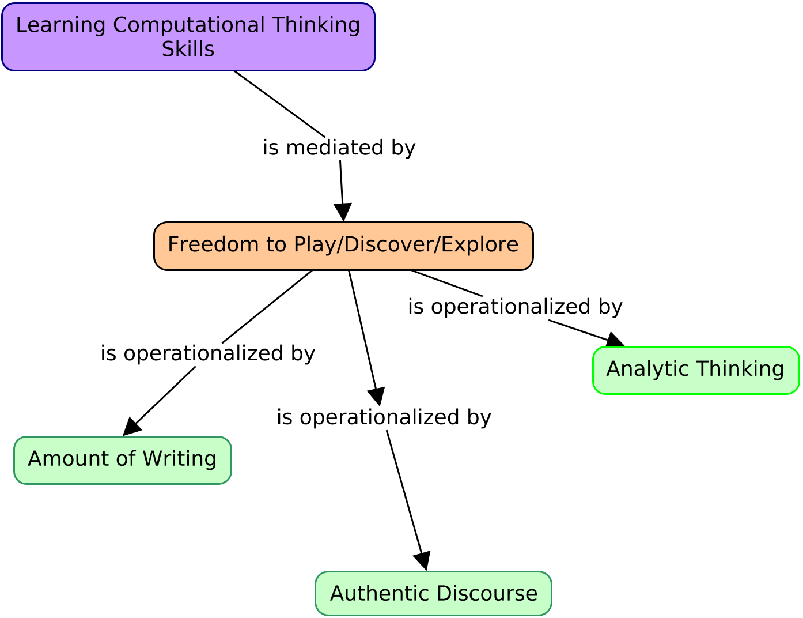

## The Project

We have been investigating the development of computational thinking skills in younger middle school students.

- Project 1: *Collaboration* and Robotics
- Project 2: *Gender* and the development of CT skills
- Project 3: Learning *abstraction*


## Wonderings, part 1

```{r, out.width = "800px", echo = FALSE, fig.align = "center"}

```

## Wonderings, part 2

```{r, out.width = "800px", echo = FALSE, fig.align = "center"}

```

## Research Questions
   
1. How do sixth graders write about their experiences of learning and practicing the computational thinking of abstraction during a robotics unit?
2. How did students’ reflective journal entries indicate the presence or absence of freedom of play, exploration, and discovery?

## Conceptual Framework

```{r, out.width = "800px", echo = FALSE, fig.align = "center"}

```


## The Context

- 20 sixth grade students participated in a 5-week LEGO Robotics Program as part of their math/science curriculum.
- Robotics program designed by their teacher (Lauren)

## Robotics Program Design

```{r, out.width = "1500px", echo = FALSE, fig.align = "center"}

```

## Robotics Program Design - Tangrams Challenge

```{r, out.width = "1500px", echo = FALSE, fig.align = "center"}

```

## Robotics Program Design - Robot Race Challenge

```{r, out.width = "1500px", echo = FALSE, fig.align = "center"}

```

## Robotics Program Design - Dance-Off Challenge

```{r, out.width = "1500px", echo = FALSE, fig.align = "center"}

```

## Student Prior Experience with LEGOs, Coding, and Robotics
```{r, out.width = "1500px", echo = FALSE, fig.align = "center"}

```

## The Methods/Data Analysis
- Student journals were transcribed.
- Student journals were investigated for features of and psychological dimensions of writing   using Linguistic Inquiry and Word Count (LIWC) software.
- Analysis focused on: *Word Counts (WC)*, *Analytic Thinking*, and *Authentic Discourse* in student writing.

## Findings, part 1 - Word Counts

```{r, out.width = "800px", echo = FALSE, fig.align = "center"}

```

## Findings, part 2 - Analytic Thinking

```{r, out.width = "750px", echo = FALSE, fig.align = "center"}

```

## Findings, part 3 - Authentic Discourse

```{r, out.width = "800px", echo = FALSE, fig.align = "center"}

```

## What Did We Learn? - Familiarity Leads To Freedom to Play

- **Word Count** was highest in most familiar/least abstract activities (robot race and final reflection).

- **Analytic Thinking** was highest in the most familiar activities (tangrams challenge and the final reflection), despite the higher degrees of abstraction present in these tasks.

- **Authentic Discourse** -The students were most authentic, most themselves, when they were writing about areas in which they felt confident and with which they were the most familiar.


## Discussion - Developing CT Skills and Freedom to Play, Explore, Discover

The development of CT skills (especially *abstraction*) is influenced by *freedom to play*

This study suggests a young student’s experience of *freedom to play* in the way we are defining it is essential to the development of these skills. 


## Questions?

```{r, out.width = "1500px", echo = FALSE, fig.align = "center"}
knitr::include_graphics("img/questions.png")
```

## Thanks
- gerald.ardito@mville.edu
- @geraldardito


